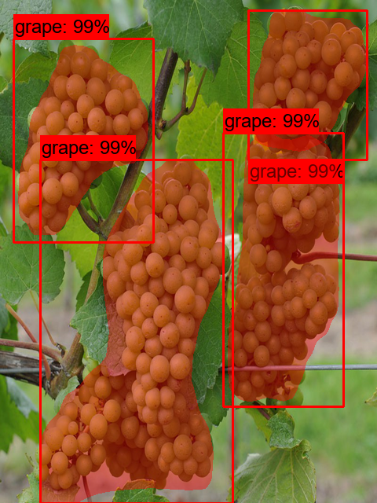

# A custom object detection model to detect grapes in vineyards using Mask R-CNN

One of the most important jobs in grape growing and production is picking and harvesting. It is considered the most pernickety step in vineyard management, wine-making and grape production, but it is pricey in terms of money paid to employees and requires a lot of effort. In addition, it is necessary to be extremely careful and almost error-free. 

This expensive task in the vineyards has not yet been automated. The project aims to develop a system to find where the grapes are located in the images or videos. Design a model with the state of the art object detection technology that can assist in deciding where to cut or pluck grapes.

The project introduces a solution by training, testing and deploying a custom object detection Mask-RCNN model. It may be used to design sensor components for a wide range of agricultural and environmental applications.

## Some detections achieved with the final model:

|  |  |
|     :---:    |     :---:      |
|    |      |     |
|     |        |       |
|     